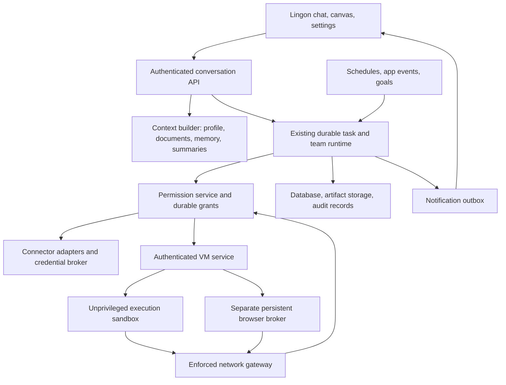

**Lingon agent chat: Muse/OpenClaw comparison and recommended work**

Reviewed and partially implemented 21 September 2026. Scope: the app in `C:/lingon/app`, its active conversation/task runtime, Azure execution, memory, automations, and the hosted ESM backend. Existing application edits were left intact; other edits appeared while the review was running, so the original findings describe the inspected working tree before the implementation pass below.

**Implemented in this pass**

- Added durable, revision-checked `IDENTITY.md`, `SOUL.md`, `USER.md`, and `AGENTS.md` records with account settings editors. Added a read-only `MEMORY.md` view backed by the existing memory records, avoiding a second source of truth.
- Made saved server transcripts authoritative for active conversation context and stripped attachment data URLs from model context.
- Replaced the 200-memory ceiling with unbounded account-scoped storage. Added USER.md-style profile facts, curated MEMORY.md facts, dated daily notes, database-backed full-archive search, relevant-only prompt retrieval, automatic extraction, explicit save/search/correct/forget tools, source metadata, and atomic supersession. Forgetting deletes the entire correction chain. A direct “remember” request still skips the extra extraction model call.
- Replaced the memory UI's stale local merge with active server state. Users can search, page through, add, correct, and delete memories; the UI distinguishes automatically saved facts from user edits and explains that chat transcripts remain after a memory is deleted.
- Reduced ordinary-chat tool declaration payload size by selecting relevant schemas per turn. The included regression check measures a 92% character reduction for a simple chat prompt in the current schema set.
- Added real query-based web discovery through the allowlisted DuckDuckGo API and connected-app tool/schema discovery.
- Moved scheduled and event automations onto the durable task runtime, including persisted exact-argument approvals and uncertain-outcome states.
- Runs shell and code jobs as an unprivileged user inside a network namespace, with separate task workspaces. Browser state runs under a separate protected OS account so code jobs cannot read its profile.
- Reuses a persistent per-session Chromium process, preserves live page state, supports typing and key actions, and enforces HTTPS host policy inside the browser process.
- Added the agent-context migration/API to both Node and hosted runtimes, kept generated mirrors synchronized, and expanded structural/performance regression tests.

Still outstanding: replacing Azure Run Command with a streaming VM daemon, stable browser element references and enforced takeover locks, durable artifacts, rolling conversation summaries, evaluated semantic memory retrieval, a trusted skill registry, and proactive goals/notification outbox. The memory workspace migration must be applied to the production database before the new schema-backed paths run there.

**Recommendation**

Keep Lingon's product and task orchestration. Add a durable agent identity/context layer, replace the interactive VM command transport, and enforce permissions at the execution/network boundary. Then add better memory, skills, and goal-driven follow-up. Simply creating Markdown files would improve configurability but would not resolve the largest capability and reliability gaps.

**Is Muse built on OpenClaw?**

I could not verify that claim from primary sources. Meta identifies its core harness as Hatch and documents a custom architecture. Its published design separates agent execution from credential services and an independent permission authority called Sentinel. It describes controls for network egress and a separate browser broker. This establishes documented architectural differences, not proof that no OpenClaw code or ideas are used internally. [Meta technical explanation](https://research.meta.ai/blog/security-and-safety-for-ai-agents-our-approach-with-muse).

Meta's design account emphasizes an interruptible main conversation, side chats, editable memory files, background work, goals, artifacts, and selective notifications. Those are useful product targets for Lingon. [Muse design](https://introducing.muse.ai/).

OpenClaw explicitly documents workspace files such as `AGENTS.md`, `SOUL.md`, `IDENTITY.md`, and `USER.md`, with bounded context loading. A workspace directory alone is not an isolation boundary. These conventions can be adopted independently of its runtime. [OpenClaw workspace](https://docs.openclaw.ai/agent-workspace), [agent runtime](https://docs.openclaw.ai/concepts/agent).

**What already exists and should stay**

| Area | Evidence in Lingon | Decision |
|---|---|---|
| Main chat with concurrent work | `app/engine.managed.js`, `server/agents/conversation.js` | Keep the foreground reply separate from background execution. |
| Durable tasks and approvals | `server/agents/task-runtime.js`, `task-store.js`, chat-task SQL migrations | Keep execution claims, revisions, exact saved approval arguments, steering, uncertainty states, and event cursors. |
| Worker teams | Team migration and `task-runtime.js` | Keep shared requirements and evidence-linked peer messages. Do not rebuild a swarm framework. |
| User VM lifecycle | `server/agents/azure-vm.js` | Keep per-user VM naming, disk persistence, leases, start/deallocation, and no public inbound access. |
| Memory and history | `memory.js`, `store.js` | Migrate and improve existing records; do not discard them for empty files. |
| Connected apps | `server/composio.js` | Keep owner/account checks, tool disable controls, and credential separation. |
| Scheduled/event work | `automations.js`, `triggers.js` | Keep scheduling, webhook validation, deduplication, and bounded chains. Move execution onto the durable task path. |
| Product surfaces | `app/app.js` | Keep mascot, customization, rich chat cards, canvas, settings, memory inspection, mailbox, and wallet. Improve the plumbing underneath them. |

These are implemented capabilities. Their presence does not establish that production migrations, worker hosting, or Azure configuration are currently healthy.

**Highest-value gaps, in priority order**

1. **A real execution boundary inside the VM — critical before broader autonomy.**

   `TOOLS.shell` and `TOOLS.code_run` require no approval. `azure-vm.js:154` and `:177` construct arbitrary execution scripts; `:863` sends them through Action Run Command without switching to an unprivileged execution user. The generated NSG at `:500` permits public web traffic, DNS, and broad AzureCloud traffic. This is not the same restriction as the five-host application fetch allowlist.

   Consequently, approving connector actions does not govern equivalent network actions made by arbitrary shell code. Model-produced code can also access files and browser profiles inside its own VM. This is a same-user data and host-integrity issue; the inspected code does not establish cross-user compromise.

   Add an unprivileged execution container or equivalent isolated process domain, no writable host mounts, resource limits, and network access forced through a policy service outside that domain. Block direct bypass routes, including private/link-local destinations and unauthorized DNS/network paths. Browser credentials and the broker must be outside the shell's readable filesystem. Enforce capability grants against user, task, action, destination, scope, and expiry. Reuse existing approval cards as the consent interface.

   Begin with deterministic policy. A second model may classify ambiguous actions later, but it cannot be the only enforcement mechanism. No need to reproduce Meta's advanced kernel data-flow tracking for a first release.

2. **An interactive VM service, replacing Run Command for everyday tools.**

   Every terminal/browser operation currently goes through the Azure management plane. Microsoft's Action Run Command documentation describes approximately 20 seconds minimum execution overhead, one script at a time, limited output, elevated execution, and no cancellation of a running script. Those constraints are structurally unsuitable for responsive browser interaction. This is provider documentation, not a measured Lingon latency result. [Azure Run Command](https://learn.microsoft.com/en-us/azure/virtual-machines/linux/run-command).

   Install a small supervised VM service with an authenticated outbound connection to Lingon. Give it durable operation IDs, streaming stdout/stderr, process-group cancellation, reconnect/status reconciliation, bounded queues, and per-task workspaces. Keep administrative Run Command for bootstrap and repair. Preserve uncertain-outcome checks: losing a connection must never automatically replay a purchase or send.

   Add image versioning, readiness checks, patch rollout/rollback, disk quotas, workspace backup/restore, export, and VM retirement. Cloud-init currently tolerates browser installation failures, so VM power state alone cannot mean browser-ready.

3. **A persistent browser process and usable interaction tools.**

   `buildBrowserSessionScript` launches Chromium, reloads the saved URL, performs one action, and closes the browser (`azure-vm.js:238`). It preserves a profile plus URL/scroll metadata, not live page state. Unsaved form values, selected elements, tabs, and application state can be lost between actions. `browser_action` only exposes click, click-by-text, and scroll to the model; typing exists in the lower-level human input path but is not an agent tool.

   Add persistent pages/tabs, stable accessibility-element references, fill/select/key/upload/download operations, controlled navigation, and credential-safe login. Make takeover an enforced lock that pauses agent actions and handles already-dispatched actions explicitly. The Node implementation has a takeover flag, but browser ownership/session registries are process-local and do not survive a restart. Hosted tools take a different path without that live-session module.

   Verify a multi-page form, login takeover, two concurrent tasks, and reconnect after server restart before calling this a dependable personal browser. Keep Chromium's own sandbox enabled where supported by the chosen runtime isolation.

4. **Durable identity, user context, and operating instructions.**

   The current main `buildSystem` in `vm-harness.js:64` selects Playful/Precise/Calm/Bold. It does not incorporate `agent.name`. Customization is principally browser state (`app/app.js:181`, `:207`) sent back as request context. I found no runtime loader for the requested Markdown documents. The repository's existing root `AGENTS.md` is developer guidance for this project, not each customer's agent configuration.

   Create a server-owned, user-scoped agent profile and versioned documents. Seed these from current onboarding and memory. Synchronize across devices, use revisions to avoid lost edits, and expose friendly editors with optional Markdown export. Do not place customer data into this repository's shared root files.

5. **Reliable memory and long-conversation context.**

   Original finding before the later memory implementation:

   `memory.js` uses word overlap/recency, an English-heavy extraction heuristic, and string-similarity deduplication. It has no explicit correction/supersession or provenance model. The advertised 200-memory cap is not a reliable global cap: Supabase retrieval only returns the latest 100, while direct `memory_write` bypasses the extraction cap and its secret filter.

   Normal conversation takes the latest 12 client-provided messages. Workers use a bounded recent observation window and can page earlier saved context. An older compaction helper exists in `sessions.js`, but the active coordinator/task path does not use it. This is partial context recovery, not a maintained long-conversation summary.

   Add authoritative transcript loading, durable rolling summaries, source-linked facts, memory search/read/update/delete tools, and scope separation for user, project, and task. Use keyword retrieval first, then hybrid semantic retrieval when evaluated. Corrections should supersede stale facts; deletion must also invalidate summaries/indexes that could reintroduce them. Keep always-relevant identity/preferences small and pinned; retrieve detailed history as needed.

   OpenClaw offers useful patterns: curated long-term notes, dated working notes, semantic recall, and saving important context before compaction. Its docs also explicitly distinguish remembered approval context from enforced permission. [OpenClaw memory](https://docs.openclaw.ai/concepts/memory).

   Implemented afterward: the 200 cap and 100-row recall truncation are gone; all active rows can be searched in PostgreSQL, while at most a small relevant set enters each prompt. User facts can be included as a bounded core, corrections supersede old rows, and deleting an entry removes its correction chain. Semantic retrieval and rolling summaries remain future work, and saved chat transcripts still exist separately from memory.

6. **One durable runtime for automations and chat work.**

   Ad-hoc tasks already persist approvals in task state. However, `automations.js:39` still invokes `vm-harness.runAgentTurn`, whose pending approval map is in memory. A scheduled action can therefore wait on an approval that disappears on restart. Do not describe durable approval support as wholly missing; unify the paths that still lack it.

   Have schedules and app events enqueue normal tasks with a trigger record, user objective, grants, and budget. Add a durable notification outbox, deduplication, quiet hours, and delivery channels. Existing SSE and VM lease heartbeats are connection/lifecycle mechanisms, not proactive goal evaluation. I found no complete goal-follow-up and notification layer in the inspected runtime.

7. **Search, connector discovery, and reusable skills.**

   The tool called `web_search` fetches model-supplied URLs; it does not perform query-based web discovery. Its five-host allowlist also constrains normal browser opening. Replace the misleading name with `web_fetch`, add actual search, and expand browsing only behind the new network boundary.

   Composio already has `listTools/getTool` support, but the active model schemas expose only connected-app listing plus generic execution. Add tool discovery and exact argument schemas so the agent need not guess action slugs. Include account selection in the exposed schema; the implementation accepts an account ID that the model declaration omits.

   Add a small trusted `SKILL.md` registry with name/description discovery and on-demand body loading. Useful initial skills: research with sources, documents/spreadsheets, connected-app workflows, browser work, and recurring monitoring. OpenClaw documents a comparable discoverable skills convention. [Skills documentation](https://docs.openclaw.ai/tools/skills).

   Agent-written skills should be scoped, versioned, inspectable, and disableable. They must not change grants, access secrets, or rewrite the enforcement service. Do not start with an unrestricted public skill marketplace.

8. **Durable files and artifact delivery.**

   Canvas output is strongest for inline text/HTML. Attachments enter the UI as data URLs; persistent VM files do not by themselves provide a robust user file service. Add owner-scoped uploads to object storage, extraction, task mounts, durable artifact IDs, MIME-aware previews, signed downloads, and retention. Test actual PDF/DOCX/XLSX output retrieval across devices. Keep the existing canvas as the presentation layer.

9. **Deployment consistency and production failure behavior.**

   `server/` and `src/lingon-server/` are not uniformly generated equivalents. `sync-lingon.mjs` generates Azure and task/coordinator modules, but several tools, stores, and harness paths are separately maintained. For example, Node browser tools use `live.js`; hosted tools call Azure directly. The Node store falls back to a file, whereas the hosted store falls back to worker memory.

   Generate/import a single runtime core with explicit transport/storage adapters. Keep both required deployment targets. In production, a database failure should not report a memory save as durable when it only reached ephemeral worker memory. Require working encryption configuration for vault writes; `encryptValue` currently falls back to base64 if no encryption key exists. These are conditional code-path risks, not findings that production lacks its keys.

   Record prompt/profile version, memory source IDs, tool/action ID, approval scope, latency, cost, queue delay, browser failures, and recovery outcomes. Never log secret values. Use these records for debugging and regression evaluation.

**Which agent files are worth adding?**

Treat the names as portable views over versioned records. Use one source of truth, preferably the existing database for this hosted app; produce VM snapshots/exports from it. Unrestricted two-way file/database sync would create another consistency problem.

| Document | Purpose and loading | Recommendation |
|---|---|---|
| `IDENTITY.md` | Name, role, style, avatar metadata; small, consistently loaded | Add now, seeded from existing customization. |
| `SOUL.md` | User-editable voice, values, collaboration preferences | Add now; edits cannot weaken platform controls. |
| `USER.md` | Preferred name, language, timezone, stable preferences | Add now; keep compact and user-correctable. |
| `AGENTS.md` | How this personal agent plans, verifies, delegates, and reports | Add a maintained template plus scoped user preferences. Keep platform rules outside its mutable content. |
| `MEMORY.md` | Curated facts and decisions | Add as a readable/editable view of existing memory, with provenance and revision history. |
| `memory/YYYY-MM-DD.md` | Working notes and task summaries | Add when context maintenance lands; retrieve selectively and enforce retention. |
| `TOOLS.md` | Non-secret conventions and capability guidance | Generate from actual enabled tools/accounts. Never treat this file as an authorization registry. |
| `skills/*/SKILL.md` | Reusable procedures | Add after tool discovery and execution controls. Load only relevant skill bodies. |
| `HEARTBEAT.md` | What to monitor, when to stay quiet, and notification preferences | Optional editing/export surface over durable goals and schedules; not the scheduler itself. |
| `BOOTSTRAP.md` | First-run setup | Optional. Reuse current onboarding instead of adding a second setup ritual. |
| `BOOT.md`, `DREAMS.md`, many persona files | Startup hooks or extra maintenance journals | Defer until an observed need justifies them. |

Prompt composition should follow an explicit hierarchy: immutable platform controls; approved owner configuration; current user task; retrieved context with source/trust labels. A web page, email, skill, or memory entry cannot grant permissions. Limit every context layer by tokens and support reading the full source on demand.

**Proposed architecture**

The VM service may administer processes, but agent code must not inherit that privilege or the service's credentials. Keep inference and the existing control plane outside the execution sandbox unless a later requirement justifies relocating them.

**What to cut or consolidate**

- Consolidate competing execution and approval paths. Preserve older endpoints through adapters until clients and automations have migrated.
- Remove independent manual maintenance of runtime copies; preserve Lovable compatibility through a shared core and generated/adapted entry points.
- Replace broad tool-name approval flags with action-specific grants. Read-only connector operations should not always cause approval fatigue, and arbitrary shell network writes should not bypass review.
- Rename the URL-fetch tool and retire keyword-routed execution after verifying all remaining callers. Preserve landing previews and harmless greeting behavior that still depend on older frontend code.
- Replace personality presets as the only behavioral customization, while retaining them as convenient starter choices.
- Defer always-on reflection models, automatic extra reviewer agents, unrestricted recursive delegation, and blanket 24/7 VM uptime. Use evaluated triggers, task budgets, and demand-based VM leases.
- Keep wallet and mailbox features, but defer expanding payment rails while execution and approval boundaries are incomplete.
- Narrow blanket internal-implementation refusals where they block useful explanations of user-visible capabilities or failures. Continue protecting secrets and privileged instructions.

**Implementation choices**

| Approach | Effort/risk | Benefit | Limitation |
|---|---|---|---|
| Minimal: add profile/documents and better context loading | Medium / low-to-medium | Agent feels consistent, editable, and more personal quickly | Browser and execution limitations remain; not Muse capability parity. |
| Recommended: evolve Lingon in stages | Large / medium | Reuses working product, tasks, integrations, and VM lifecycle; addresses actual gaps | Requires infrastructure work and integration testing. |
| Replace/embed OpenClaw as the core runtime | Large-to-extra-large / high migration risk | Potential reuse of skills and session conventions | Must reconcile hosted tenancy, billing, approvals, data ownership, UI events, and existing task semantics; not an automatic Muse security equivalent. |

**Suggested delivery order and acceptance gates**

1. **Foundation:** unify contracts, move automations onto durable tasks, add production configuration checks, enforce unprivileged execution and constrained egress. Ship profile/documents alongside this when independent. Gate: restart cannot lose an approval; denied network actions stay denied through shell/browser; private user state remains owner-scoped.
2. **Computer:** deploy VM service and persistent browser, enforce takeover, add artifact transport and readiness/backup lifecycle. Gate: form state survives successive actions; work resumes after reconnect; cancellation kills the intended process group; generated files download correctly.
3. **Continuity:** authoritative chat state, memory correction/deletion, summaries, bounded retrieval, document versioning, skill discovery. Gate: rename/style changes survive another device; corrected preferences override old ones; a long conversation retains its commitments; deleted facts are not reconstructed from derived caches.
4. **Proactivity:** durable goals with completion criteria, scheduled/event checks, notification outbox, change detection, user budgets and quiet hours. Gate: browser closed overnight, background task completes and yields one useful notification; unchanged monitoring yields none; ambiguous external outcomes require reconciliation.

Do not promise timing or cost improvements until measuring cold/warm VM latency, browser action p50/p95, task success, unnecessary approval frequency, duplicate side effects, memory precision, and cost per completed user outcome.

**Verification and limits**

The full `npm test` suite and production `npm run build` pass after implementation. Tests cover account sync coalescing, schema selection, unprivileged/networkless script generation, persistent browser construction, streaming, controlled concurrency, approvals/recovery, and SQL-backed team coordination. The schema payload check measures serialized declaration size, not billed tokens or end-to-end latency.

No live Azure VM, production Supabase migration, or real connected account was changed from this workspace. Live cold/warm VM latency, browser success rates, production task cost, and isolation must still be measured after deployment. The implementation cannot remove Azure Run Command's management-plane latency until the proposed VM daemon replaces it.
